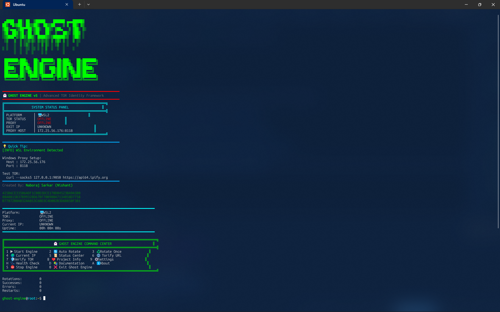
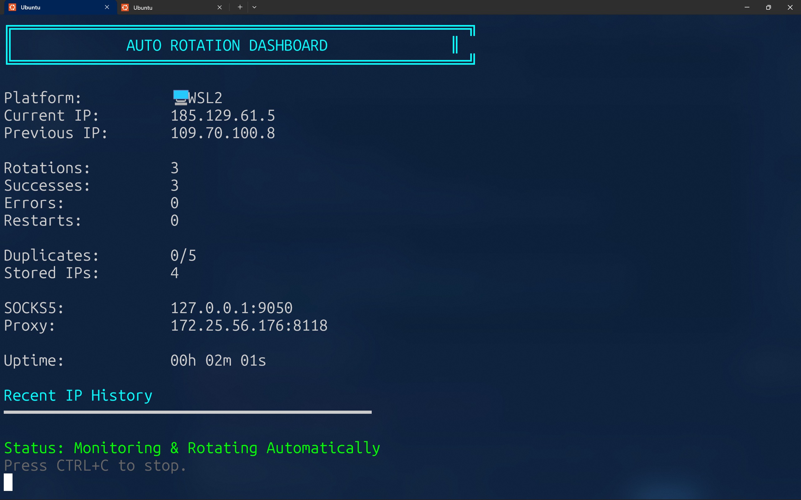
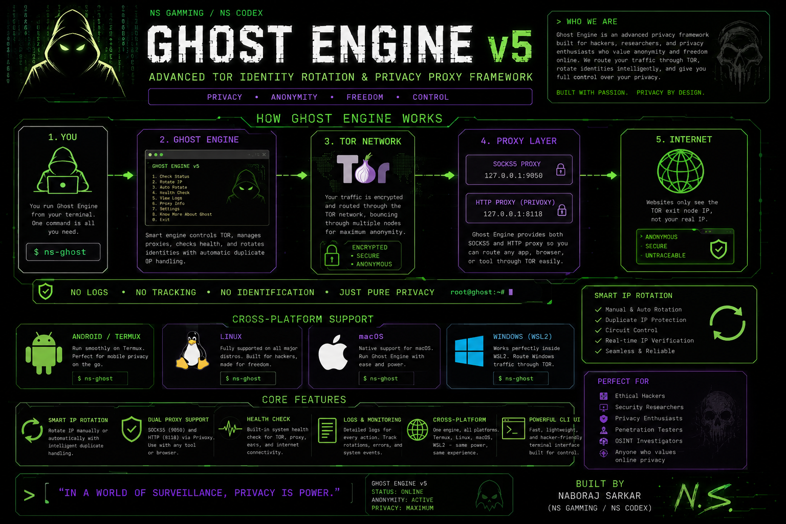
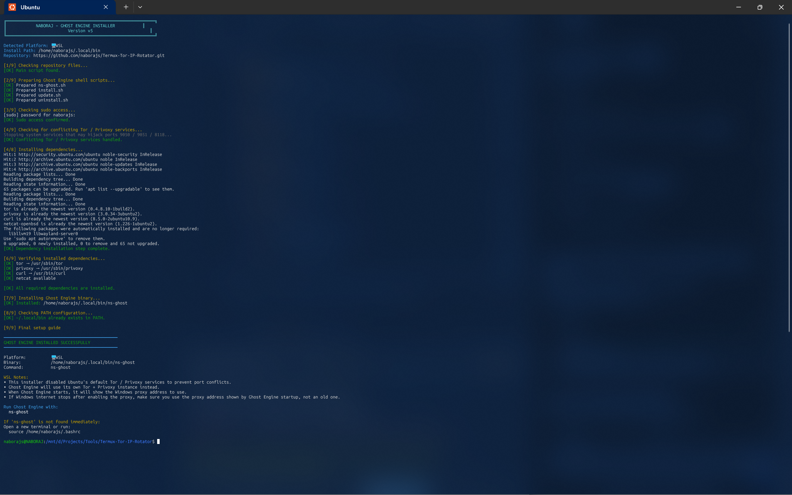
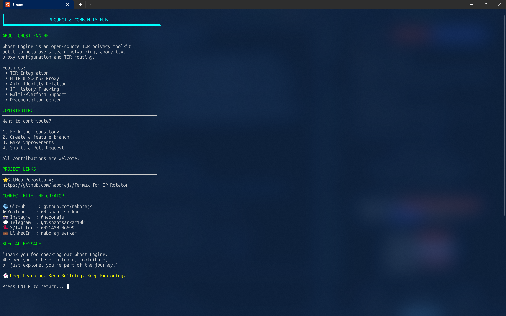

<div align="center">

  <br />

  
  
  
  

  <br />
  <br />

  
  
  
  

<br /><br />

  <pre>
   ██████╗ ██╗  ██╗ ██████╗ ███████╗████████╗
  ██╔════╝ ██║  ██║██╔═══██╗██╔════╝╚══██╔══╝
  ██║  ███╗███████║██║   ██║███████╗   ██║
  ██║   ██║██╔══██║██║   ██║╚════██║   ██║
  ╚██████╔╝██║  ██║╚██████╔╝███████║   ██║
   ╚═════╝ ╚═╝  ╚═╝ ╚═════╝ ╚══════╝   ╚═╝
  </pre>

  <h1>👻 Ghost Engine v5</h1>
  <p><strong>Advanced TOR Identity Rotation & Privacy Proxy Framework</strong></p>

  <p>
    Smart TOR IP rotation, SOCKS5 + HTTP proxy routing, health checks, and cross-platform privacy tooling
    for <strong>Termux</strong>, <strong>Linux</strong>, <strong>macOS</strong>, and <strong>WSL2</strong>.
  </p>

  <br />

  <a href="https://github.com/naborajs/Termux-Tor-IP-Rotator">
    
  </a>
  <a href="https://github.com/naborajs/Termux-Tor-IP-Rotator/issues">
    
  </a>
  <a href="https://github.com/naborajs/Termux-Tor-IP-Rotator/releases">
    
  </a>
  <a href="https://github.com/naborajs">
    
  </a>

<br /><br />

  <table>
    <tr>
      <td align="center"><strong>🌀 TOR Rotation</strong></td>
      <td align="center"><strong>🌐 Proxy Ready</strong></td>
      <td align="center"><strong>🧠 Diagnostics</strong></td>
      <td align="center"><strong>🖥 Multi-Platform</strong></td>
    </tr>
    <tr>
      <td align="center">Manual + auto identity rotation with duplicate handling</td>
      <td align="center">SOCKS5 and Privoxy HTTP proxy support</td>
      <td align="center">Health checks, logs, exit-node verification, and recovery</td>
      <td align="center">Built for Termux, Linux, macOS, and WSL2 workflows</td>
    </tr>
  </table>

  <br />

  <sub>
    Built and maintained by <strong>Naboraj Sarkar</strong> • NS GAMMING / NS CODEX
  </sub>

</div>

---
<div align="center">

  <h2>👀 Ghost Engine Preview</h2>
  <p>
    A quick look at Ghost Engine’s command center and automatic TOR rotation dashboard.
  </p>

  
  <br />
  <sub><b>Home / Command Center</b></sub>

  <br /><br /><br />

  
  <br />
  <sub><b>Automatic TOR Rotation Dashboard</b></sub>

</div>

---

## ⚠️ Responsible Use

Ghost Engine is intended for:

- privacy-focused learning and experimentation
- TOR routing / proxy testing
- research, lab use, and controlled security workflows

It is **not** intended for illegal activity, abuse, or unauthorized access.  
You are responsible for how you use this tool and for complying with your local laws and network policies.


---
<div align="center">

  <h2>🧠 How Ghost Engine Works</h2>
  <p>
    A visual overview of Ghost Engine’s privacy workflow, TOR routing model, proxy layers,
    platform support, and core features across Termux, Linux, macOS, and WSL2.
  </p>

  
  <br />
  <sub><b>Ghost Engine v5 — TOR identity rotation, proxy routing, health checks, and cross-platform privacy workflow</b></sub>

</div>

---

## 🚀 Quick Start — Android (Termux) *Recommended*

Ghost Engine works very well on **Android through Termux** and this is one of the easiest ways to use it on mobile.

> **Important:** Install **Termux from F-Droid**, not from the Play Store.
> The Play Store build is outdated and can break package installation, networking tools, and Ghost Engine itself.

### Install Termux from F-Droid

https://f-droid.org/en/packages/com.termux/

---

## 1) Update Termux

Start by updating the package lists and upgrading installed packages:

```bash id="m4x3cq"
pkg update -y && pkg upgrade -y
```

---

## 2) Install Git

```bash id="ec3p1u"
pkg install git -y
```

---

## 3) Clone the Ghost Engine Repository

```bash id="e7p1xk"
git clone https://github.com/naborajs/Termux-Tor-IP-Rotator.git
cd Termux-Tor-IP-Rotator
```

---

## 4) Run the Installer

Ghost Engine includes a built-in installer that handles dependency installation and global command setup for Termux.

```bash id="yn7v9a"
chmod +x install.sh
bash install.sh
```

The installer will automatically:

* detect that you are using **Termux**
* install required packages such as **TOR**, **Privoxy**, **curl**, and **netcat**
* install the global **`ns-ghost`** command
* prepare Ghost Engine’s runtime environment for mobile use
<div align="center">

  <h3>🛠 Installer Preview</h3>
  <p>
    Ghost Engine’s installer auto-detects your platform, installs required dependencies,
    prepares the runtime environment, and sets up the global <code>ns-ghost</code> launcher.
  </p>

  
  <br />
  <sub><b>Ghost Engine installer running in the terminal</b></sub>

</div>
---

## 5) If Privoxy Fails to Install in Termux

Some Termux setups may require the **TUR repository** for Privoxy.

If the installer reports a Privoxy installation problem, run:

```bash id="q4z9yu"
pkg install tur-repo -y
pkg install privoxy -y
```

Then run the installer again:

```bash id="qcb4j2"
bash install.sh
```

---

## 6) Launch Ghost Engine

Once installation is complete, start Ghost Engine with:

```bash id="ep4mfw"
ns-ghost
```

On the **first launch**, wait around **10–20 seconds** while TOR builds its first secure circuit.

---

## 7) What the Installer Does on Termux

The Termux installer is designed to simplify setup as much as possible.

It will:

* install Ghost Engine’s required dependencies
* install the `ns-ghost` launcher into your Termux environment
* prepare local TOR + Privoxy runtime files
* help standardize the environment so Ghost Engine behaves consistently across fresh Termux installs

---

## 8) Verify That Ghost Engine Is Working

Once Ghost Engine is running, test whether traffic is going through TOR:

```bash id="b79vga"
curl --proxy http://127.0.0.1:8118 https://api64.ipify.org
```

You can also compare your real IP vs your TOR IP:

### Real IP

```bash id="z2p0gk"
curl https://api64.ipify.org
```

### TOR-routed IP

```bash id="5vx4w0"
curl --proxy http://127.0.0.1:8118 https://api64.ipify.org
```

If the two IPs are different, Ghost Engine is routing through TOR successfully.

---

## 9) Notes for Android / Termux Users

* Some Android apps do **not** automatically use the Termux proxy. Ghost Engine works best for:

  * terminal-based tools
  * local testing
  * browsers / apps that allow manual proxy configuration
* On slower mobile networks, TOR bootstrapping may take longer than on desktop.
* If you are rotating IPs very quickly, expect occasional duplicate exit nodes — that is normal TOR behavior.

---

## 10) Updating or Removing Ghost Engine on Termux

### Update to the latest version

```bash id="j8x4vu"
bash update.sh
```

### Uninstall Ghost Engine

```bash id="n8twg4"
bash uninstall.sh
```

---

## 11) If Something Goes Wrong

If Ghost Engine does not start correctly in Termux:

* run the built-in **Health Check**
* confirm that TOR and Privoxy installed successfully
* retry `bash install.sh`
* if Privoxy failed earlier, install `tur-repo` and reinstall it manually
* check the **Troubleshooting** section of the README

> **Tip:** If you only want the fastest setup path on Android, the normal flow is:
> `pkg update → install git → clone repo → bash install.sh → ns-ghost`

---

## 💻 Installation — Linux (Debian / Ubuntu / Kali / Parrot)

Ghost Engine supports **Debian-based Linux distributions** including:

* **Ubuntu**
* **Debian**
* **Kali Linux**
* **Parrot OS**
* and other compatible `apt`-based systems

The recommended installation method is to use Ghost Engine’s **built-in installer**, which automatically installs dependencies, configures the global launcher, and disables conflicting system TOR / Privoxy services if needed.

---

## 1) Install Git (if not already installed)

```bash id="b5njx1"
sudo apt update
sudo apt install git -y
```

---

## 2) Clone the Ghost Engine Repository

```bash id="h2g5w9"
git clone https://github.com/naborajs/Termux-Tor-IP-Rotator.git
cd Termux-Tor-IP-Rotator
```

---

## 3) Run the Installer

```bash id="b3a2r7"
chmod +x install.sh
bash install.sh
```

The installer will automatically:

* detect your Linux environment
* install required dependencies (`tor`, `privoxy`, `curl`, `netcat`)
* install the global `ns-ghost` launcher
* add `~/.local/bin` to your PATH if needed
* stop / disable conflicting **system TOR** or **Privoxy** services that could break Ghost Engine

---

## 4) Start Ghost Engine

After installation completes, launch Ghost Engine with:

```bash id="wq3n9p"
ns-ghost
```

If the command is not found immediately, either:

* open a **new terminal session**, or
* reload your shell profile:

```bash id="3cbfxj"
source ~/.bashrc
```

If you use **Zsh** instead of Bash:

```bash id="m8q4nf"
source ~/.zshrc
```

---

## 5) What the Installer Handles Automatically

Ghost Engine’s Linux installer is designed to prevent the most common setup problems.

### It installs:

* **TOR**
* **Privoxy**
* **curl**
* **netcat / nc**

### It also helps avoid conflicts by:

* stopping system TOR if it is already running
* stopping system Privoxy if it is already running
* disabling those services if they would hijack Ghost Engine’s ports
* preparing Ghost Engine to run its **own isolated TOR + Privoxy environment**

This is important because Ghost Engine expects to manage ports like:

* **9050** → TOR SOCKS5
* **9051** → TOR control port
* **8118** → Privoxy HTTP proxy

If another TOR / Privoxy instance is already using those ports, Ghost Engine may fail to start correctly or route traffic through the wrong service.

---

## 6) Manual Dependency Command (Reference Only)

You usually **do not need to run this manually** because `install.sh` already handles it, but for reference Ghost Engine depends on:

```bash id="tn7r4k"
sudo apt update
sudo apt install tor privoxy curl netcat-openbsd -y
```

---

## 7) Verify That Ghost Engine Works

Once Ghost Engine is running, verify that traffic is actually going through TOR:

### Check TOR-routed IP through the HTTP proxy

```bash id="4uqn0r"
curl --proxy http://127.0.0.1:8118 https://api64.ipify.org
```

### Check TOR-routed IP through the SOCKS5 proxy directly

```bash id="d9jpm6"
curl --socks5 127.0.0.1:9050 https://api64.ipify.org
```

If the returned IP is different from your normal internet IP, Ghost Engine is working correctly.

You can also visit:

* https://check.torproject.org/
* https://api64.ipify.org/

---

## 8) Linux Notes

* Ghost Engine is designed to run its **own runtime configuration** instead of depending on your system’s default TOR / Privoxy configuration.
* If you already use TOR or Privoxy for other tools, be aware that Ghost Engine may need those ports free to work properly.
* If you are using a minimal distro or custom environment, make sure `curl`, `nc`, `tor`, and `privoxy` are available in your PATH.

---

## 9) Updating and Removing Ghost Engine on Linux

### Update to the latest version

```bash id="r9c4zv"
bash update.sh
```

### Uninstall Ghost Engine

```bash id="w3jv6q"
bash uninstall.sh
```

---

## 10) If Something Goes Wrong

If Ghost Engine installs correctly but still does not work:

1. Run the built-in **Health Check** from the Ghost Engine menu
2. Make sure no old TOR / Privoxy service is still using ports `9050`, `9051`, or `8118`
3. Verify that `ns-ghost` is in your PATH
4. Check the project’s **Troubleshooting** section for Linux / proxy / port-conflict fixes

> **Tip:** On Linux, most Ghost Engine startup problems come from **port conflicts**, **old system TOR services**, or the shell not yet seeing `~/.local/bin` in PATH.

---

## ☕ macOS (Intel + Apple Silicon)

Ghost Engine supports **macOS on both Intel and Apple Silicon Macs**.
The recommended setup uses **Homebrew** for installing TOR, Privoxy, and required utilities.

---

### Requirements

Before installing Ghost Engine on macOS, make sure you have:

* **macOS with Terminal access**
* **Homebrew**
* an active internet connection
* permission to install packages locally

---

## 1) Install Homebrew

If Homebrew is not already installed, run:

```bash id="c64rzu"
/bin/bash -c "$(curl -fsSL https://raw.githubusercontent.com/Homebrew/install/HEAD/install.sh)"
```

After installation, verify it:

```bash id="6h3u5c"
brew --version
```

---

## 2) Clone the Ghost Engine Repository

```bash id="52q1sn"
git clone https://github.com/naborajs/Termux-Tor-IP-Rotator.git
cd Termux-Tor-IP-Rotator
```

---

## 3) Run the Installer

Ghost Engine now includes a dedicated installer that automatically installs dependencies and sets up the global `ns-ghost` command.

```bash id="pq5sgq"
chmod +x install.sh
bash install.sh
```

The installer will:

* detect that you are on **macOS**
* use **Homebrew** to install required dependencies
* install the Ghost Engine launcher command
* prepare the environment for running `ns-ghost`

---

## 4) Start Ghost Engine

After installation completes, launch Ghost Engine with:

```bash id="xqk7y0"
ns-ghost
```

If the command is not available immediately, open a **new Terminal session** and run it again.

---

## 5) What the Installer Uses on macOS

Ghost Engine installs / checks the following tools through Homebrew:

```bash id="wz7tne"
brew install tor privoxy curl netcat
```

If one of these is already installed, Homebrew will simply keep the existing package.

---

## 6) Verify That Ghost Engine Works

Once Ghost Engine is running, you can verify TOR routing using:

```bash id="ff0kfy"
curl --proxy http://127.0.0.1:8118 https://api64.ipify.org
```

You can also open:

* https://check.torproject.org/
* https://api64.ipify.org/

If the IP shown there is different from your normal internet IP, Ghost Engine is routing traffic through TOR successfully.

---

## 7) Notes for macOS Users

* Ghost Engine uses its **own runtime configuration** for TOR and Privoxy rather than expecting you to configure them manually.
* If Homebrew is installed under **Apple Silicon** paths (`/opt/homebrew`), the installer will automatically use that environment.
* If you already use TOR or Privoxy for another purpose on your Mac, stop those services before running Ghost Engine to avoid port conflicts.

---

## 8) Updating or Removing Ghost Engine on macOS

### Update to the latest version

```bash id="1huj2y"
bash update.sh
```

### Uninstall Ghost Engine

```bash id="ynwggf"
bash uninstall.sh
```

> **Tip:** If you ever run into startup issues on macOS, run Ghost Engine’s built-in **Health Check** first. It’s the quickest way to confirm whether TOR, Privoxy, ports, and exit-node routing are working properly.

---

🪟 Windows (WSL2 Only)

1. Enable WSL & Ubuntu from Microsoft Store


2. Open Ubuntu terminal (WSL2)


Then:
```
sudo apt update
sudo apt install git tor privoxy curl netcat -y
```
```
git clone https://github.com/ns-gamming/Termux-Tor-IP-Rotator
cd Termux-Tor-IP-Rotator
chmod +x ns-ghost.sh
./ns-ghost.sh
```

---

🤖 Auto Debian/Ubuntu Installer (Optional but Cool)

For Debian/Ubuntu/Kali/Parrot/WSL2 users, you can create an auto installer:

Create a file called install_debian.sh:

nano install_debian.sh

Paste this inside:

#!/usr/bin/env bash
set -e

echo "[*] Ghost Engine v4 — Auto Installer (Debian/Ubuntu)"
echo

# Check for sudo
if ! command -v sudo >/dev/null 2>&1; then
  echo "[!] sudo not found. Please install sudo or run as root."
  exit 1
fi

# Update system
echo "[*] Updating system..."
sudo apt update -y && sudo apt upgrade -y

# Install dependencies
echo "[*] Installing dependencies (git, tor, privoxy, curl, netcat)..."
sudo apt install -y git tor privoxy curl netcat || {
  echo "[!] Failed to install dependencies. Check your sources and try again."
  exit 1
}

# Clone repo if needed
if [ ! -d "$HOME/Termux-Tor-IP-Rotator" ]; then
  echo "[*] Cloning repository..."
  git clone https://github.com/ns-gamming/Termux-Tor-IP-Rotator "$HOME/Termux-Tor-IP-Rotator"
else
  echo "[*] Repo already exists. Pulling latest changes..."
  cd "$HOME/Termux-Tor-IP-Rotator"
  git pull || true
fi

cd "$HOME/Termux-Tor-IP-Rotator"

# Make main script executable
if [ -f "ns-ghost.sh" ]; then
  chmod +x ns-ghost.sh
  echo "[*] Running Ghost Engine..."
  ./ns-ghost.sh
else
  echo "[!] ns-ghost.sh not found. Please check repository structure."
  exit 1
fi

echo
echo "[✓] Ghost Engine setup finished. Enjoy staying anonymous 👻"

Save & exit, then:
```
chmod +x install_debian.sh
./install_debian.sh
```
This will:

Update your system

Install required packages

Clone/update the repo

Run ns-ghost.sh automatically

---

## 🌐 Route Traffic Through Ghost Engine

Once Ghost Engine is running, you can route apps, browsers, and CLI tools through its local TOR proxy.

### Android / Termux (Wi-Fi Proxy)

To route your phone’s traffic through Ghost Engine:

1. Open **Settings → Wi-Fi**
2. Long-press your connected network → **Modify network**
3. Expand **Advanced options**
4. Set **Proxy** to **Manual**

Use:

| Field        | Value       |
| ------------ | ----------- |
| **Hostname** | `127.0.0.1` |
| **Port**     | `8118`      |

> ⚠ If Ghost Engine is **off** while your Android proxy is still enabled, internet access may stop working until you disable the proxy.

---

### CLI Tools (Linux / Termux / macOS / WSL)

You can also route terminal tools through Ghost Engine directly.

**HTTP proxy via Privoxy**

```bash
curl --proxy http://127.0.0.1:8118 https://api64.ipify.org
```

**SOCKS5 via TOR**

```bash
curl --socks5 127.0.0.1:9050 https://api64.ipify.org
```

If the returned IP is different from your normal ISP / mobile IP, your request is being routed through TOR.


---

## ✅ Verify That TOR Is Working

After starting Ghost Engine, always verify that your traffic is actually being routed through the TOR network before using it for browsing, research, or testing.

---

### 1) Terminal Verification

#### Verify through the HTTP proxy (Privoxy)

```bash id="2nftvz"
curl --proxy http://127.0.0.1:8118 https://api64.ipify.org
```

#### Verify through the SOCKS5 TOR proxy directly

```bash id="e8y1jj"
curl --socks5 127.0.0.1:9050 https://api64.ipify.org
```

If Ghost Engine is working correctly, the IP returned above should be **different from your real ISP / mobile / Wi-Fi IP**.

---

### 2) Compare TOR IP vs Real IP

You can compare your normal internet IP with your TOR-routed IP:

#### Real IP

```bash id="h1j5b8"
curl https://api64.ipify.org
```

#### TOR IP

```bash id="zopvmo"
curl --proxy http://127.0.0.1:8118 https://api64.ipify.org
```

If the two IPs are different, your request is being routed through TOR.

---

### 3) Browser Verification

Open your browser **after enabling Ghost Engine’s proxy** and visit:

* **TOR Check:** https://check.torproject.org/
* **IP Check:** https://api64.ipify.org/

If everything is configured correctly:

* **check.torproject.org** should say that you are using TOR
* the IP shown in the browser should match the TOR IP shown inside Ghost Engine or the terminal verification commands

---

### 4) WSL / Windows Verification

If you are using **Ghost Engine inside WSL**, make sure you use the **HTTP proxy address shown by Ghost Engine’s startup screen** inside Windows proxy settings.

Then verify in Windows:

1. Enable the manual proxy using the address shown by Ghost Engine
2. Open a browser in Windows
3. Visit:

   * https://check.torproject.org/
   * https://api64.ipify.org/

If the site still shows your real IP, double-check that:

* Ghost Engine is still running in WSL
* the Windows proxy host and port match the values shown in the Ghost Engine startup guide
* no old proxy settings are still enabled

---

### 5) Common Signs That TOR Is **Not** Working

If any of these happen, traffic may not be routed through Ghost Engine:

* The IP shown is still your normal ISP / mobile IP
* `curl --proxy http://127.0.0.1:8118 ...` fails to connect
* Browser works normally even when Ghost Engine is stopped
* `check.torproject.org` says you are **not** using TOR
* The proxy is enabled, but Ghost Engine is not running

---

### 6) Recommended Quick Test Flow

Use this simple 3-step check every time:

```bash id="u1w37l"
curl https://api64.ipify.org
curl --proxy http://127.0.0.1:8118 https://api64.ipify.org
curl --socks5 127.0.0.1:9050 https://api64.ipify.org
```

You want:

* the **first IP** = your real IP
* the **second / third IP** = TOR exit IP
* the **second and third IPs** should usually match or both be TOR-routed

> **Tip:** Ghost Engine’s built-in **Health Check** and **Current IP** screens are the fastest way to confirm that TOR, Privoxy, and exit-node routing are working properly.

<div align="center">

  <h3>📘 Documentation / Guided Experience</h3>
  <p>
    Ghost Engine also includes a guided terminal experience with built-in help, platform-aware setup hints,
    and a workflow designed to keep installation and usage simple across Termux, Linux, macOS, and WSL2.
  </p>

  
  <br />
  <sub><b>Ghost Engine documentation / guided terminal workflow preview</b></sub>

</div>

---

## 🐞 Troubleshooting & Error Handling

If Ghost Engine is not working as expected, use the table below to quickly identify the issue, understand the likely cause, and apply the recommended fix.

| Problem                                                                | Likely Reason / Root Cause                                                                                       | Recommended Fix                                                                                                                    |
| ---------------------------------------------------------------------- | ---------------------------------------------------------------------------------------------------------------- | ---------------------------------------------------------------------------------------------------------------------------------- |
| **No internet after enabling proxy**                                   | Proxy is enabled, but Ghost Engine / TOR / Privoxy is not running, or the wrong proxy host was entered           | Disable the proxy temporarily, start Ghost Engine again, and use the exact proxy host + port shown by Ghost Engine                 |
| **WSL proxy kills Windows internet**                                   | Windows is using the wrong proxy address, or Ubuntu’s default Privoxy / TOR service conflicted with Ghost Engine | Re-run `install.sh`, let it disable conflicting system services, then use the proxy host shown in Ghost Engine’s WSL startup guide |
| **TOR stuck at 5–20% bootstrapping**                                   | Slow internet, blocked relays, unstable network, or TOR cannot reach enough nodes                                | Wait longer, restart Ghost Engine, switch networks, or try using a VPN before TOR if your network blocks TOR relays                |
| **Same IP repeats after rotation**                                     | TOR reused the same exit relay, interval is too short, or exit pool is limited                                   | Rotate again, increase the rotation interval, or let Ghost Engine restart the engine after duplicate threshold is reached          |
| **Auto-rotation shows duplicate IPs too often**                        | TOR has not had enough time to build a fresh circuit, or the chosen country / network path keeps reusing exits   | Increase the auto-rotation interval to 10–20 seconds and avoid rotating too aggressively                                           |
| **`privoxy: command not found` in Termux**                             | Privoxy repository package is missing or not installed correctly                                                 | Run `pkg update -y && pkg install tur-repo -y && pkg install privoxy -y`                                                           |
| **`tor: command not found`**                                           | TOR is not installed or the dependency installation failed                                                       | Re-run `bash install.sh` and make sure TOR installs successfully                                                                   |
| **Browser still shows your real IP**                                   | Browser is not using Ghost Engine’s proxy, or traffic is leaking through WebRTC / bypass settings                | Make sure the browser is using the Ghost Engine proxy, test with `check.torproject.org`, and disable WebRTC if needed              |
| **Chrome still shows real IP**                                         | Chrome may bypass proxy in some cases or leak IP through WebRTC                                                  | Prefer Firefox for TOR proxy testing, or disable WebRTC / secure browser leaks before testing                                      |
| **`ns-ghost: command not found`**                                      | Installer was not run, installation failed, or PATH was not refreshed                                            | Run `bash install.sh` from the repo root, then open a new terminal or reload your shell profile                                    |
| **Permission denied when running a script**                            | The script does not have execute permission                                                                      | Run `chmod +x install.sh update.sh uninstall.sh ns-ghost.sh`                                                                       |
| **`curl: (7) Failed to connect to 127.0.0.1`**                         | TOR / Privoxy is not running, the engine failed to start, or the port is wrong                                   | Start Ghost Engine first and verify that TOR and Privoxy are listening on the configured ports                                     |
| **Port 8118 already in use**                                           | Another Privoxy instance or system service is already using the Ghost Engine HTTP proxy port                     | Stop the conflicting service, or re-run the installer so it disables system Privoxy / TOR services automatically                   |
| **Port 9050 / 9051 already in use**                                    | Another TOR process is already running in the background                                                         | Kill the old TOR process or restart Ghost Engine after cleaning the old session                                                    |
| **Ghost Engine says proxy is online but Windows browser still fails**  | Windows proxy settings still point to an old WSL IP or an old manual proxy entry                                 | Disable the Windows proxy, restart Ghost Engine, and enter the new proxy address shown in the startup screen                       |
| **Health Check fails exit node verification**                          | TOR started, but the current circuit is not fully usable yet or outbound requests are blocked                    | Wait a few seconds, retry Health Check, or restart Ghost Engine and verify internet connectivity                                   |
| **Updater fails with git errors**                                      | Local repo has conflicts, no internet, or the repository was not cloned properly                                 | Run `git status`, resolve local changes if needed, and retry `bash update.sh` from the Ghost Engine repo                           |
| **Uninstaller removed the command but Ghost Engine data still exists** | The data directory was intentionally kept during uninstall                                                       | Delete `~/.ns_ghost` manually or run the uninstaller again and choose to remove Ghost Engine data                                  |
| **Ghost Engine works in terminal but not in apps**                     | The application does not support manual proxy routing or ignores system proxy settings                           | Test first in a browser or terminal, then configure the app manually if it supports SOCKS5 / HTTP proxy settings                   |

---

## Quick Recovery Checklist

If Ghost Engine stops working and you want the fastest recovery path, try this:

### 1) Stop any old TOR / Privoxy processes

```bash id="c7r8vf"
pkill tor 2>/dev/null
pkill privoxy 2>/dev/null
```

### 2) Start Ghost Engine again

```bash id="j5f4tw"
ns-ghost
```

### 3) Run a quick proxy test

```bash id="ptz7c4"
curl --proxy http://127.0.0.1:8118 https://api64.ipify.org
```

### 4) If you are on WSL

* Disable the Windows manual proxy first
* Restart Ghost Engine
* Re-enter the **new** proxy host and port shown in Ghost Engine’s startup guide

---

## When to Re-run the Installer

You should run `install.sh` again if:

* TOR or Privoxy is missing
* WSL / Linux is using a conflicting system TOR or Privoxy service
* `ns-ghost` is not found after installation
* the project was updated and your environment is broken
* dependencies were removed or partially installed

```bash id="xkp84r"
bash install.sh
```

---

## When to Use Health Check

If you are unsure whether the issue is:

* internet-related
* TOR-related
* proxy-related
* exit-node-related

open Ghost Engine and run **Health Check** from the menu.
It is the fastest built-in way to confirm whether:

* internet access is working
* TOR is listening
* Privoxy is listening
* the control port is reachable
* an exit IP can actually be fetched

---


## 🔄 Updating & Uninstalling

Keep Ghost Engine up to date to get the latest fixes, platform improvements, and stability updates.

### Update Ghost Engine

Pull the latest changes from the repository and reinstall the newest build:

```bash
cd ~/Termux-Tor-IP-Rotator
bash update.sh
```

### Uninstall Ghost Engine

Remove the installed Ghost Engine binary and optionally clean up its local data, logs, and configuration files:

```bash
cd ~/Termux-Tor-IP-Rotator
bash uninstall.sh
```

### What these scripts do

* **`update.sh`**

  * Pulls the latest version of Ghost Engine from the repository
  * Re-runs the installer to update your global `ns-ghost` command
  * Preserves your existing project folder and workflow

* **`uninstall.sh`**

  * Removes the installed `ns-ghost` launcher
  * Stops Ghost Engine services if they are running
  * Optionally removes the local Ghost Engine data directory (`~/.ns_ghost`)

> **Tip:** On Linux / WSL, if the `ns-ghost` command doesn’t refresh immediately after updating, open a new terminal session or reload your shell profile.


---

---

<div align="center">
  <h2>❓ Frequently Asked Questions</h2>
  <p>
    Common questions about <strong>Ghost Engine</strong>, TOR routing, privacy expectations,
    platform behavior, performance, and safe usage.
  </p>
</div>

<br />

<table>
  <tr>
    <th align="left">Question</th>
    <th align="left">Answer</th>
  </tr>

  <tr>
    <td><strong>Does Ghost Engine make me completely anonymous?</strong></td>
    <td>
      <strong>No.</strong> No privacy tool can honestly promise <strong>100% anonymity</strong>.
      Ghost Engine helps improve <strong>network privacy</strong> by routing traffic through TOR,
      rotating visible exit IPs, and exposing SOCKS5 / HTTP proxy workflows.  
      <br /><br />
      Your privacy still depends on things like:
      <ul>
        <li>what accounts you log into</li>
        <li>your browser fingerprint and extensions</li>
        <li>cookies / session storage</li>
        <li>DNS / WebRTC / browser leaks outside the proxy path</li>
        <li>your own behavior and operational security</li>
      </ul>
      Think of Ghost Engine as a <strong>TOR routing and identity-rotation utility</strong>,
      not a magic invisibility button.
    </td>
  </tr>

  <tr>
    <td><strong>What does Ghost Engine actually do?</strong></td>
    <td>
      Ghost Engine is a terminal-based toolkit that helps you work with:
      <ul>
        <li><strong>TOR exit-node rotation</strong></li>
        <li><strong>SOCKS5 proxy routing</strong></li>
        <li><strong>Privoxy HTTP proxy support</strong></li>
        <li><strong>manual and automatic identity changes</strong></li>
        <li><strong>health checks, diagnostics, logs, and session monitoring</strong></li>
      </ul>
      It is designed to make TOR-based proxy workflows easier across
      <strong>Termux, Linux, macOS, and WSL</strong>.
    </td>
  </tr>

  <tr>
    <td><strong>Can I use a VPN together with Ghost Engine?</strong></td>
    <td>
      <strong>Yes.</strong> A common setup is:
      <br /><br />
      <code>You → VPN → TOR (Ghost Engine) → Internet</code>
      <br /><br />
      That means your ISP sees a VPN connection, and TOR traffic goes out through the VPN.
      This can be useful in places where TOR traffic is blocked or monitored.
      <br /><br />
      Just remember the trade-offs:
      <ul>
        <li>higher latency</li>
        <li>more moving parts</li>
        <li>you are placing some trust in your VPN provider</li>
      </ul>
      Ghost Engine does not require a VPN, but it can be used with one if that fits your setup.
    </td>
  </tr>

  <tr>
    <td><strong>Will my internet speed or ping be worse?</strong></td>
    <td>
      <strong>Yes — usually.</strong> TOR adds multiple encrypted relay hops, which means:
      <ul>
        <li>higher latency / ping</li>
        <li>slower downloads and page loads compared to direct internet</li>
        <li>less consistent performance depending on exit-node quality</li>
      </ul>
      Ghost Engine is a <strong>privacy / routing / experimentation tool</strong>, not a low-latency gaming or streaming accelerator.
    </td>
  </tr>

  <tr>
    <td><strong>Can I route my browser through Ghost Engine?</strong></td>
    <td>
      <strong>Yes.</strong> Ghost Engine exposes:
      <ul>
        <li><strong>SOCKS5 TOR proxy</strong> (default TOR port, usually <code>9050</code>)</li>
        <li><strong>HTTP proxy through Privoxy</strong> (usually <code>8118</code>)</li>
      </ul>
      You can configure supported browsers or apps to use those proxy endpoints.
      <br /><br />
      On <strong>WSL</strong>, Ghost Engine also shows the Windows-side proxy address you should use if you want Windows apps or browsers to route through the WSL-hosted proxy.
    </td>
  </tr>

  <tr>
    <td><strong>Why does the same IP sometimes repeat after rotation?</strong></td>
    <td>
      That can happen because TOR is not an infinite IP generator. A repeated IP does <strong>not</strong> automatically mean Ghost Engine is broken.
      <br /><br />
      Reasons include:
      <ul>
        <li>TOR reused the same exit relay</li>
        <li>the interval between rotations is too short</li>
        <li>the available exit-node pool is limited for the current route / country / network path</li>
      </ul>
      Ghost Engine’s duplicate tracking and restart logic helps reduce this, but it cannot force TOR to always give a brand-new exit IP on every single request.
    </td>
  </tr>

  <tr>
    <td><strong>Can Ghost Engine force a new TOR IP every time?</strong></td>
    <td>
      <strong>Not guaranteed.</strong> Ghost Engine can request a new TOR identity and rotate circuits,
      but the final exit node chosen still depends on TOR’s network behavior.
      <br /><br />
      So Ghost Engine can <strong>request and automate identity changes</strong>,
      but it cannot guarantee that every rotation will produce a totally unique public IP.
    </td>
  </tr>

  <tr>
    <td><strong>What’s the difference between the SOCKS5 proxy and the HTTP proxy?</strong></td>
    <td>
      Ghost Engine gives you two common ways to route traffic:
      <ul>
        <li>
          <strong>SOCKS5 (TOR directly)</strong> — useful for apps or tools that support SOCKS proxies natively.
        </li>
        <li>
          <strong>HTTP Proxy (Privoxy)</strong> — useful for apps or browsers that prefer a normal HTTP proxy endpoint.
        </li>
      </ul>
      Both ultimately route through TOR, but the app compatibility and configuration flow may differ.
    </td>
  </tr>

  <tr>
    <td><strong>Does Ghost Engine change my entire system traffic automatically?</strong></td>
    <td>
      <strong>No, not by itself.</strong> Ghost Engine provides proxy endpoints and rotation tooling.
      Traffic only goes through Ghost Engine if:
      <ul>
        <li>your application is configured to use Ghost Engine’s proxy, or</li>
        <li>your operating system / browser is pointed at the proxy Ghost Engine provides</li>
      </ul>
      If an app is not using the proxy, Ghost Engine will not magically capture it.
    </td>
  </tr>

  <tr>
    <td><strong>Can I use Ghost Engine on WSL?</strong></td>
    <td>
      <strong>Yes.</strong> Ghost Engine supports <strong>WSL2</strong>, and the installer / startup flow is designed to help with the common WSL proxy issues.
      <br /><br />
      In WSL, Ghost Engine can:
      <ul>
        <li>run TOR and Privoxy inside the Linux environment</li>
        <li>show the proxy host / port needed by Windows</li>
        <li>help avoid conflicts with default system TOR / Privoxy services</li>
      </ul>
      If you want Windows apps to use Ghost Engine, use the <strong>proxy host and port shown by Ghost Engine</strong> rather than assuming it is always plain localhost.
    </td>
  </tr>

  <tr>
    <td><strong>Why does enabling the Windows proxy sometimes break internet in WSL setups?</strong></td>
    <td>
      Usually one of these is happening:
      <ul>
        <li>Windows is pointing to the wrong proxy address</li>
        <li>Ghost Engine is not running anymore</li>
        <li>a conflicting system Privoxy / TOR service is still active</li>
        <li>the proxy host changed between WSL sessions</li>
      </ul>
      The safest fix is:
      <ol>
        <li>disable the Windows proxy temporarily</li>
        <li>restart Ghost Engine</li>
        <li>use the exact proxy host + port shown in Ghost Engine’s startup guide</li>
      </ol>
    </td>
  </tr>

  <tr>
    <td><strong>Can I use Ghost Engine on Android?</strong></td>
    <td>
      <strong>Yes — through Termux.</strong> That is one of the main supported platforms.
      <br /><br />
      The recommended setup is:
      <ul>
        <li>install <strong>Termux from F-Droid</strong></li>
        <li>clone the Ghost Engine repository</li>
        <li>run <code>bash install.sh</code></li>
        <li>launch with <code>ns-ghost</code></li>
      </ul>
      Some Android apps may not honor the proxy automatically, so results depend on the app you are using.
    </td>
  </tr>

  <tr>
    <td><strong>Does Ghost Engine work on macOS and Linux too?</strong></td>
    <td>
      <strong>Yes.</strong> Ghost Engine supports:
      <ul>
        <li><strong>Android / Termux</strong></li>
        <li><strong>Linux</strong> (Debian / Ubuntu / Kali / Parrot and similar apt-based systems)</li>
        <li><strong>macOS</strong> (Intel and Apple Silicon)</li>
        <li><strong>WSL2</strong></li>
      </ul>
      The installer detects the platform and installs / prepares the environment accordingly.
    </td>
  </tr>

  <tr>
    <td><strong>How do I verify that TOR is actually working?</strong></td>
    <td>
      A quick check is to compare your normal IP and your TOR-routed IP.
      <br /><br />
      <strong>Real IP:</strong><br />
      <code>curl https://api64.ipify.org</code>
      <br /><br />
      <strong>TOR IP through Ghost Engine:</strong><br />
      <code>curl --proxy http://127.0.0.1:8118 https://api64.ipify.org</code>
      <br /><br />
      If those IPs are different, traffic is being routed through TOR.  
      You can also verify in a browser with:
      <ul>
        <li><a href="https://check.torproject.org/">https://check.torproject.org/</a></li>
        <li><a href="https://api64.ipify.org/">https://api64.ipify.org/</a></li>
      </ul>
    </td>
  </tr>

  <tr>
    <td><strong>Why does Ghost Engine include both logs and a health check?</strong></td>
    <td>
      Because proxy / TOR setups can fail in several different ways:
      <ul>
        <li>internet is down</li>
        <li>TOR did not bootstrap</li>
        <li>Privoxy did not start</li>
        <li>ports are already in use</li>
        <li>exit-node verification failed</li>
      </ul>
      The built-in <strong>Health Check</strong> and status / log screens help you quickly see whether the problem is internet-related, TOR-related, proxy-related, or platform-related.
    </td>
  </tr>

  <tr>
    <td><strong>Can I use Ghost Engine for illegal activity, abuse, or unauthorized access?</strong></td>
    <td>
      <strong>No.</strong> Ghost Engine is intended for:
      <ul>
        <li>privacy-focused experimentation</li>
        <li>learning and education</li>
        <li>research and controlled testing</li>
        <li>legitimate TOR / proxy workflows</li>
      </ul>
      You are responsible for how you use the tool and for complying with your local laws, service rules, and network policies.
    </td>
  </tr>

  <tr>
    <td><strong>Can I contribute to Ghost Engine?</strong></td>
    <td>
      <strong>Absolutely.</strong> If you want to help improve Ghost Engine, you can:
      <ul>
        <li>open an issue for a bug or feature request</li>
        <li>submit a pull request for fixes, improvements, or documentation upgrades</li>
        <li>test the project on your platform and report what works / what breaks</li>
      </ul>
      Useful links:
      <ul>
        <li><a href="https://github.com/naborajs/Termux-Tor-IP-Rotator">Repository</a></li>
        <li><a href="https://github.com/naborajs/Termux-Tor-IP-Rotator/issues">Issues</a></li>
        <li><a href="https://github.com/naborajs/Termux-Tor-IP-Rotator/pulls">Pull Requests</a></li>
      </ul>
    </td>
  </tr>

</table>

<br />

<div align="center">
  <p>
    Still have a question, found a bug, or want to suggest an improvement?
  </p>

  <a href="https://github.com/naborajs/Termux-Tor-IP-Rotator/issues">
    
  </a>
  <a href="https://github.com/naborajs/Termux-Tor-IP-Rotator/pulls">
    
  </a>
  <a href="https://github.com/naborajs/Termux-Tor-IP-Rotator/discussions">
    
  </a>
</div>

---

<div align="center">
  <h2>💖 Support & Contribute</h2>
  <p>
    <strong>Ghost Engine</strong> is an independent open-source project built through testing, debugging,
    experimentation, and a lot of iteration.
  </p>
  <p>
    If it helps you, the best support is simple:
    <strong>star the repo, report bugs, suggest improvements, or open a pull request.</strong>
  </p>
  Please read our <a href="./CODE_OF_CONDUCT.md">CODE_OF_CONDUCT.md</a> before participating in issues, discussions, or pull requests.
</div>

<br />

<table align="center">
  <tr>
    <td align="center"><strong>⭐ Support</strong></td>
    <td align="center"><strong>🛠 Contribute</strong></td>
    <td align="center"><strong>📬 Collaborate</strong></td>
  </tr>
  <tr>
    <td align="center">Star the repo, share it, and give feedback</td>
    <td align="center">Fix bugs, improve docs, refine features, or polish the UX</td>
    <td align="center">Open an Issue or Pull Request and I’ll take a look at it</td>
  </tr>
</table>

<br />

<div align="center">

  <a href="https://github.com/naborajs/Termux-Tor-IP-Rotator">
    
  </a>
  <a href="https://github.com/naborajs/Termux-Tor-IP-Rotator/issues">
    
  </a>
  <a href="https://github.com/naborajs/Termux-Tor-IP-Rotator/pulls">
    
  </a>

</div>


---

### 🪙 Donation Addresses

| Cryptocurrency | Address |
|----------------|---------|
| **Bitcoin (BTC)** | `bc1q5zapes7euft2lrk7ylpwj90p8y4ctmadn285du` |

---

✨ Even the smallest support means something —  
not because of the money…  
but because it tells me:

> **"Someone out there believes in this project."**

Thank you for being here —  
and thank you for keeping the Ghost alive 👻💙

---

<div align="center">

  <h2>🧠 Know More About Ghost</h2>
  <p>
    Ghost Engine also includes a built-in project knowledge screen that introduces the framework,
    its purpose, platform support, privacy workflow, and core ideas directly inside the terminal UI.
  </p>

  
  <br />
  <sub><b>Built-in project knowledge / “Know More About Ghost” terminal preview</b></sub>

</div>

---

<div align="center">

  <h2>👤 Author & Contact</h2>
  <p>
    <strong>Ghost Engine</strong> is built and maintained by
    <strong>Naboraj Sarkar</strong>
    <br />
    also known online as <strong>Nishant Sarkar</strong>.
  </p>

  <p>
    <em>Developer • Builder • Creator • NS CODEX</em>
  </p>

  <br />

  <a href="mailto:nishant.ns.business@gmail.com">
    
  </a>
  <a href="https://nsgamming.xyz">
    
  </a>
  <a href="https://github.com/naborajs">
    
  </a>

  <br />
  <br />

  <a href="https://youtube.com/@Nishant_sarkar">
    
  </a>
  <a href="https://t.me/nsgamming69">
    
  </a>
  <a href="https://instagram.com/naborajs">
    
  </a>
  <a href="https://x.com/NSGAMMING699">
    
  </a>

  <br />
  <br />

  <table>
    <tr>
      <td align="center"><strong>🧠 Focus Areas</strong></td>
      <td align="center"><strong>⚙️ Project Style</strong></td>
      <td align="center"><strong>🌍 Ecosystem</strong></td>
    </tr>
    <tr>
      <td align="center">Privacy Tools, Automation, Bots, Utility Projects</td>
      <td align="center">Terminal-first, Cross-platform, Practical, Experimental</td>
      <td align="center">Ghost Engine, NS GAMMING, NS CODEX</td>
    </tr>
  </table>

  <br />

  <p>
    If you find a bug, want to suggest a feature, or want to contribute to Ghost Engine,
    feel free to open an issue on GitHub or reach out through one of the platforms above.
  </p>

</div>

<p><sub>Built with 💙 by Naboraj Sarkar • Open-source privacy tooling and terminal experiments</sub></p>

---

🏷 License

This project is licensed under the MIT License.
You are free to use, modify, and redistribute — as long as proper credit is given.


---

<div align="center">⭐ If this project helped you —

PLEASE STAR ⭐ THE REPOSITORY

<br>💙 Stay Anonymous
💙 Stay Secure
💙 Stay Ghost 👻

</div>
